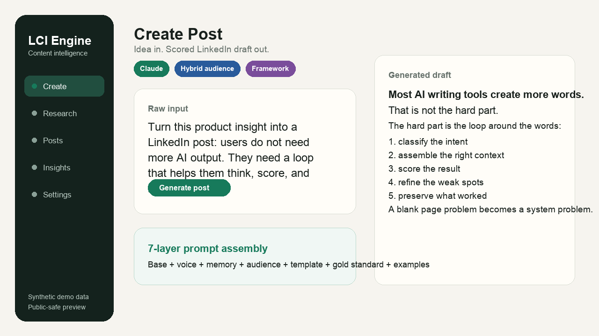
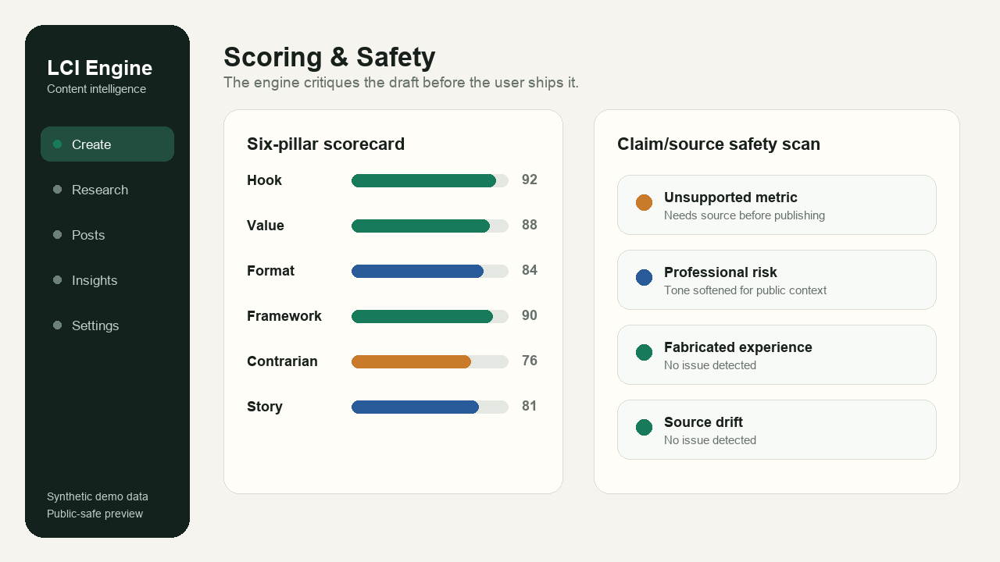
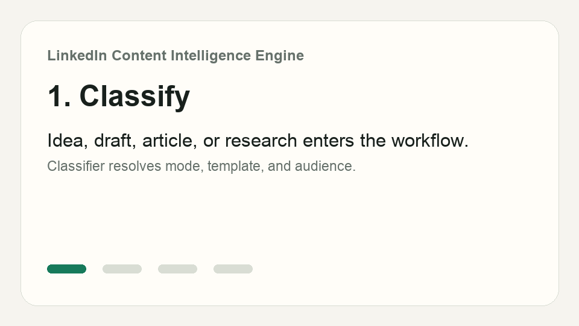
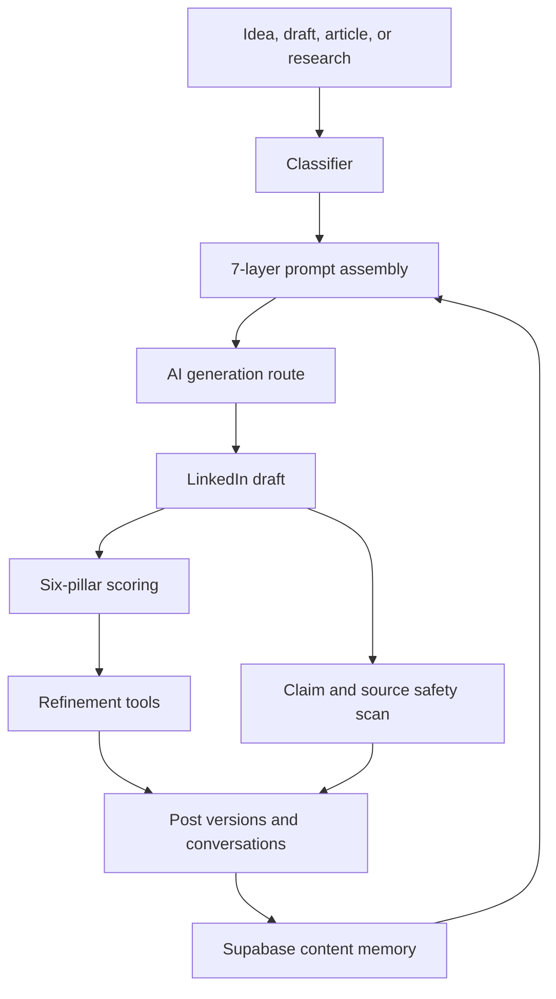

# LinkedIn Content Intelligence Engine

Most AI writing apps stop at generation. This one keeps the loop alive.

**LinkedIn Content Intelligence Engine** is a production-derived, sanitized AI content system that turns raw ideas, drafts, articles, and research into scored LinkedIn posts with source-aware generation, refinement tools, safety checks, post history, and audience intelligence.

It started as a bespoke creator workflow. This repo is the reusable framework extracted from it: clean public data, portable prompts, reproducible setup, and a redaction gate that keeps the public boundary honest.

[](https://nextjs.org/)
[](https://supabase.com/)
[](https://www.typescriptlang.org/)
[](https://tailwindcss.com/)
[](https://ai-sdk.dev/)
[](https://vitest.dev/)

[](https://vercel.com/new)



## Table of Contents

- [Why This Exists](#why-this-exists)
- [Product Demo](#product-demo)
- [By The Numbers](#by-the-numbers)
- [How It Works](#how-it-works)
- [Copywriting Engine](#copywriting-engine)
- [Technical Depth](#technical-depth)
- [Quick Start](#quick-start)
- [Code Surface](#code-surface)
- [Roadmap](#roadmap)
- [Public Boundary](#public-boundary)
- [License](#license)

## Why This Exists

The hard part of AI content products is not calling a model.

The hard part is building the loop around the model:

1. Understand what the user is trying to create.
2. Assemble the right prompt context.
3. Generate useful content without inventing facts.
4. Score the draft against a repeatable standard.
5. Offer targeted improvements.
6. Preserve history, feedback, and audience signal.

This repo demonstrates that loop end to end. It is built for recruiters to inspect quickly and for builders to adapt without inheriting any private customer context.

## Product Demo





The core workflow:

1. Start with an idea, draft, article, or research question.
2. Classify the input into mode, audience, and template.
3. Generate a LinkedIn post through layered prompt assembly.
4. Score the result across six pillars.
5. Apply focused refinement tools.
6. Run claim/source safety checks before publishing.

## By The Numbers

| Signal | Count |
| --- | ---: |
| Prompt assembly layers | 7 |
| Scoring pillars | 6 |
| Public copywriting techniques | 12 |
| API route files | 16 |
| Edge runtime routes | 5 |
| Supabase tables | 13 |
| Public sanitization checks | 5 |

The source system was larger. This README only claims numbers the public repo can prove from its own tree.

## How It Works



The loop is intentionally stateful. Saved posts, high-scoring examples, audience intelligence, and recent openings can all feed back into future generations.

## Copywriting Engine

The app scores and improves posts with six public pillars:

| Pillar | What It Rewards |
| --- | --- |
| Hook | A first line that creates enough tension to stop the scroll. |
| Value | Specific, useful, provable insight instead of generic advice. |
| Format | Short lines, clean structure, and mobile-readable pacing. |
| Framework | Named steps, lists, and repeatable mental models. |
| Contrarian | A clear point of view that challenges a lazy default. |
| Story | A concrete moment that turns into a useful lesson. |

Refinement tools use the same pillar language, so scoring does not live in a separate universe from editing.

## Technical Depth

- **7-layer prompt assembly** combines base rules, voice constraints, post intelligence, audience context, template instructions, dynamic gold standards, and matched examples.
- **Edge AI routes** stream generation, chat, research, scoring-adjacent refinement, and safety workflows without Node-only runtime assumptions.
- **Research-to-create bridge** moves synthesized research into the post composer through browser session state.
- **Dynamic gold standards** select strong prior examples from Supabase instead of hardcoding every reference post.
- **Generated database columns** keep score and engagement totals consistent while write paths strip values the database owns.
- **Settings precedence** lets environment keys override encrypted Supabase settings for deploy-friendly demos.
- **Public sanitization tests** check excluded paths, private identifiers, legacy filenames, and placeholder-only environment values.

## Quick Start

```bash
npm ci
cp .env.example .env.local
npm run typecheck
npm run test:public
npm run build
npm run dev
```

Then create a Supabase project, run `supabase/migrations/0001_public_schema.sql`, and load `supabase/seed.sql` for synthetic demo data.

The Vercel button above opens the deploy flow. The full app still needs Supabase environment variables, the migration, and at least one AI provider key.

## Code Surface

Prompt assembly is deliberately explicit. The generation route awaits the full context stack before streaming:

```ts
const system = await assembleSystemPrompt(
  mode,
  template,
  audience,
  postIntelligence,
  isArticle,
  audienceIntelligenceBlock,
);
```

That one call pulls together the content strategy, audience angle, historical context, template choice, gold standard, and synthetic examples before the model writes a word.

## Roadmap

- [x] 7-layer prompt assembly
- [x] Six-pillar scoring
- [x] Article-to-post mode
- [x] Research-to-create bridge
- [x] Claim and source safety scan
- [x] Synthetic Supabase seed data
- [x] Public redaction and sanitization gate
- [ ] One-click deploy template with guided Supabase setup
- [ ] Multi-user authentication
- [ ] Hosted demo with disposable sample data
- [ ] Import/export workflow for creator-owned post archives

## Public Boundary

This repo is intentionally public-safe:

- Synthetic seed data only.
- Placeholder environment values only.
- No scraped personal exports.
- No private customer identifiers.
- No private project IDs or deployment names.
- No copyrighted source transcripts.
- No local agent handoffs or internal workspace folders.

See [docs/public/SPEC.md](docs/public/SPEC.md) for the full reproduction, architecture, schema, prompt pipeline, seed data, verification, and redaction spec.

## License

MIT. See [LICENSE](LICENSE).
